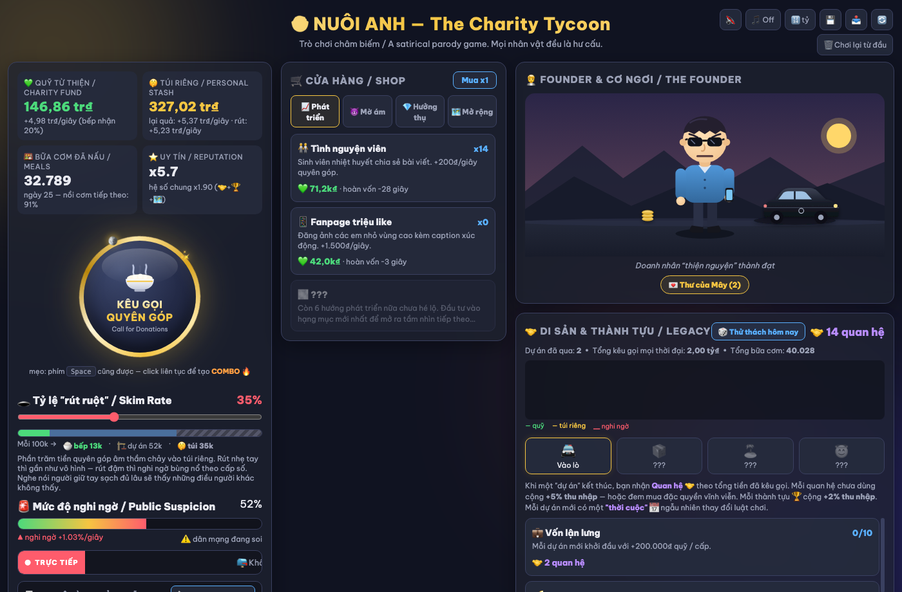

# 🍚 Nuôi Anh — The Charity Tycoon

**▶️ Chơi ngay / Play now: https://techeese.github.io/nuoi-anh-clicker/**

A satirical Vietnamese idle/clicker game. You run a charity feeding mountain children —
and decide, minute by minute, whether to run it honestly… or become exactly the kind of
founder the news warned everyone about.

## Hai con đường / Two paths

- 😈 **Con đường tối**: kéo thanh "rút ruột", mở mã nuôi em trùng lặp, hoá đơn khống, công ty
  sân sau — tiền "lại quả" chảy thẳng vào túi riêng. Quản lý nhiệt nghi ngờ bằng PR, luật sư,
  tiệm rửa xe… và nếu mọi thứ vỡ lở, vẫn còn một buổi livestream khóc xin lỗi. Gom đủ 33 tỷ
  để "đi công tác nước ngoài".
- 😇 **Con đường sáng**: giữ tay sạch đủ lâu, nấu đủ bữa cơm thật, và một lá thư viết tay từ
  vùng cao sẽ mở ra con đường ẩn — hào quang ✨, danh tiếng sạch, và kết cục bí mật.

Suspicion is live and legible. Crime pays — visibly. Virtue pays too — secretly.
The only way to starve the kitchen is your own greed.

## Features

- Single self-contained `index.html` — no build, no dependencies. Open it and play.
  Installable as a PWA, works offline.
- **Money you can see**: every skimmed click visibly splits (+net rises, −cut sinks with a
  🤫), the slider shows where each 100k goes, and scheme kickbacks drip into the stash on
  screen. Even the SFX follow your conscience — clean clicks ring bright, dirty ones dull.
- **Bé Mây's letters**: stay clean and a child from Điện Biên writes you real letters — and
  you choose how to write back. Handwritten replies are remembered. Go dirty and the
  mailbox quietly goes silent.
- **Chị phóng viên**: a 3-stage investigative arc where bribes get photographed, lawsuits
  backfire, and genuinely reforming earns you the redemption piece 'Người quay đầu'.
- **Newspaper endings**: every run ends as a front page written from your own numbers,
  archived in your case files forever and mintable as a shareable image card.
- Prestige meta (connections 🤝 + permanent perks), 4 endings, 30+ achievements, lifetime
  records, daily seeded challenge, day/night cycle, 11 run modifiers, an apology-livestream
  minigame, state-aware events with consequences only for crimes you actually committed.
- Hand-drawn SVG founder avatar (his face, car, villa and sweat reflect your choices) and a
  geo-accurate Vietnam influence map. Synthesized WebAudio everything — no asset files.
- Balance tuned by an automated simulator against 12 design targets: `node sweep.js`.

## ⚠️ Disclaimer

Đây là trò chơi châm biếm (parody) nhằm mục đích giải trí và phê phán xã hội. Mọi nhân vật
đều là hư cấu, không ám chỉ cá nhân hay tổ chức cụ thể nào. Hãy luôn tìm hiểu kỹ và quyên góp
cho các tổ chức từ thiện minh bạch.

This is a satirical parody for entertainment and social commentary. All characters are
fictional. Please donate responsibly to transparent charities.

## Dev

| File | Purpose |
|---|---|
| `index.html` | the entire game |
| `engine.js` / `sweep.js` | balance simulation + auto-tuning against 12 design targets |
| `sim.js` | standalone strategy simulator |
| `DESIGN.md` | design charter — read before changing anything |
| `clear-save.html` | factory-reset helper |
